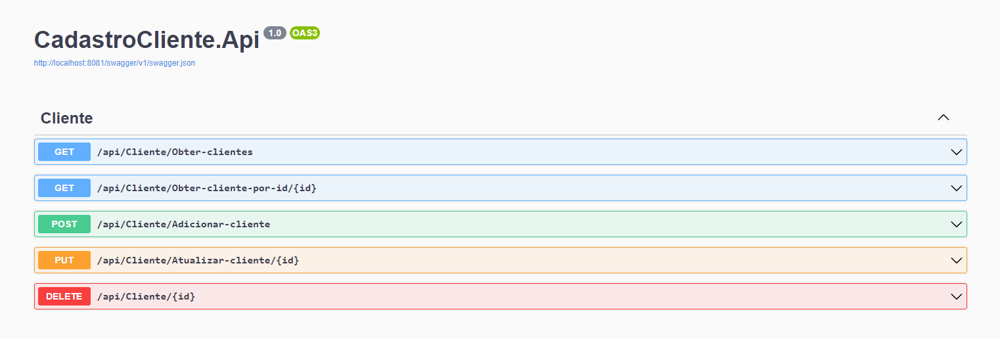

# Projeto XP

Neste repositório estão disponíveis os arquivos de automatização para iniciar a aplicação em um container docker

## Como utilizar

Para criar o ambiente, podemos realizar os seguintes passos

> **Requisito:** É necessário ter o docker instalado em seu sistema operacional (Linux, Windows ou Mac)

### Disponibilizando backend e banco de dados no docker
Após realizar o clone do projeto, siga até o diretório /src onde se encontra o Dockerfile e o arquivo Docker-Compose-yml e rode o seguinte comando em seu terminal:  
- ` docker-compose up --build` 

### E agora?
Com seu container rodando as imagens do sql server e do asp net core,
você terá acesso a documentação da api via swagger no endereço: http://localhost:8081/swagger/index.html

